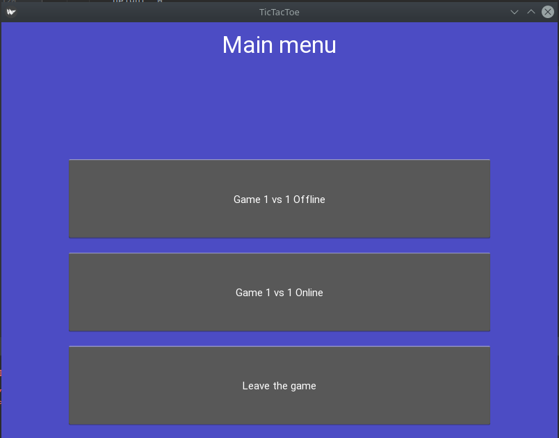
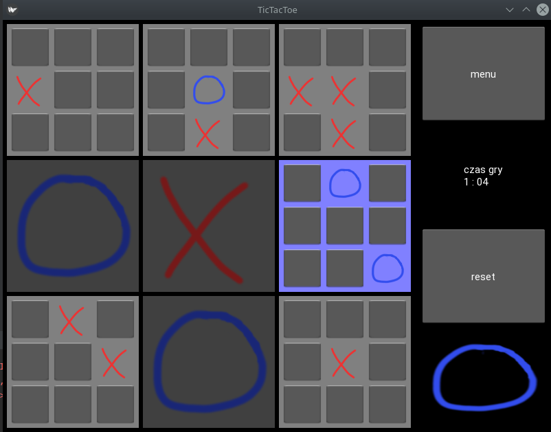
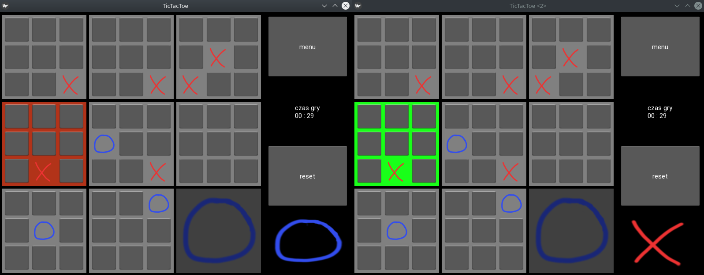
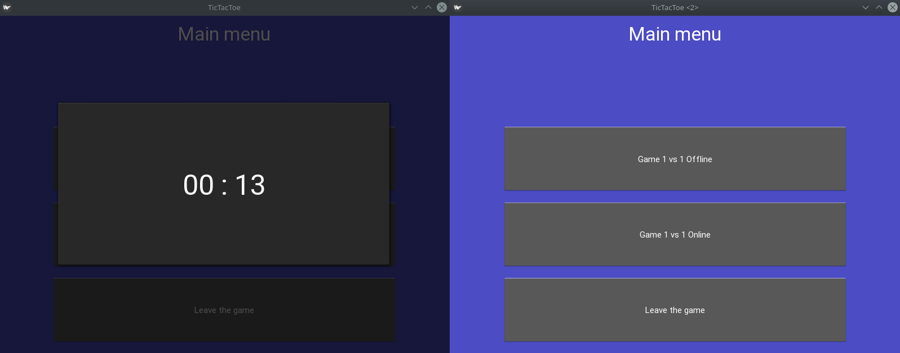
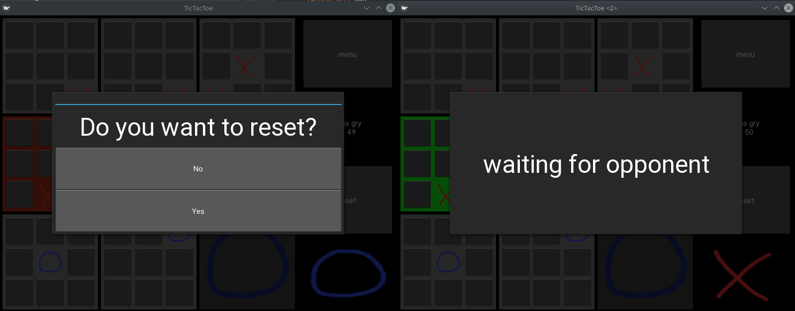

## Requirements
* python3.7 (or 3.5, 3.6. Kivy does not support python3.8)
* kivy 1.11.1
* twisted (for the server)

## Server

If you are running server from console, you probably need to run:
```
$ PYTHONPATH=`pwd` python server/ServerMain.py
```

## Client
Same as server:
```
PYTHONPATH=`pwd` python client/mainApp.py 
```

## Game GUI










